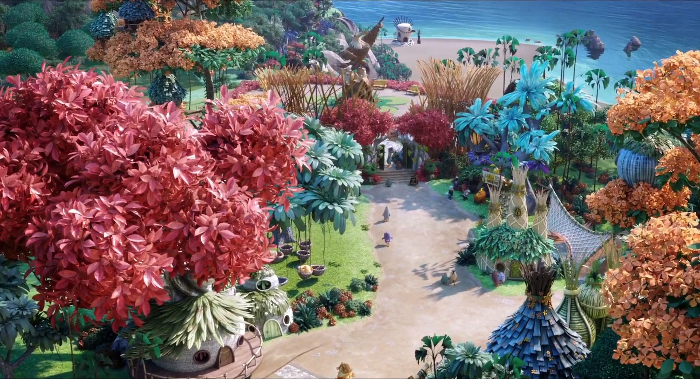

Cascades
===================

The classifier Folders are the newly finished cascades for the 30, 40 and 60 sign.
In the *Negatives* Folder you find some random Landscape photos for the classifier to 
train on.
Int the *traffic-sign-\** folder there are the original photos for the traffic 
signs, the cropped ones and the scaled ones.
Sadly there is not a useful script out there to download and crop every image so 
you have to do it manually for everyone. 
Some tools used for this include:
* [SnippingTool](https://support.microsoft.com/en-us/help/13776/windows-use-snipping-tool-to-capture-screenshots)
* [gThumb](https://wiki.gnome.org/Apps/gthumb)

> **IMPORTANT:** You have to install ImageMagick and ffmpeg for this scripts to actually work.
From the distribution of your choice:                                                                                                                                              
Arch:
```
# pacman -S imagemagick ffmpeg
```
Debian:
```
# apt-get install imagemagick ffmpeg
``` 
Fedora:
```
# yum install ImageMagick ffmpeg
```

The positive images are just Traffic Sign images taken from the Street like this one:


And the final cropped and sized one you would give as Input for the training:


Negatives should be random Images, in my case I extracted them from the Angry Birds movie 
> **IMPORTANT:** I don't know about legal issues with this kind of images of course this movie
is copyrighted but it was the fastest way to get a lot of these *random* images.



### Rename.sh
```
Usage:
-d or --directory     <directory> (optional)
-f or --file-type     <file extension>
-id                   <identification of files>
-h or help display this message
example: $1 -id 120 -f jpg -d my-folder
```
Most photos of traffic signs online come with bad to read or strange Names so to keep
the repository tidy I wrote this short scrip to quickly rename every file (specified by format) an give it a meaningful *ID*.

### Scale.sh
```
Usage:
-d or --directory     <directory> (optional)
-w or --width         <width of output image>
-h or --height        <height of output image>
-h or help display this message
example: $1 -d my-folder -w 40 -h 80
```
For best performance at the training stage you have to make sure every positive image is 
exactly the same size. Doing this manually will take a lot of time so this script does 
for you. Specify the directory where the images are located and 


### Extract-negatives.sh


Format every png file in a folder to jpg.
Mogrify is a cli tool form the ImageMagick Package so make sure to install it beforehand.
```
$ mogrify format jpg *.png
```
This creates a copy of the png file but in jpg Format no files are overwrite


